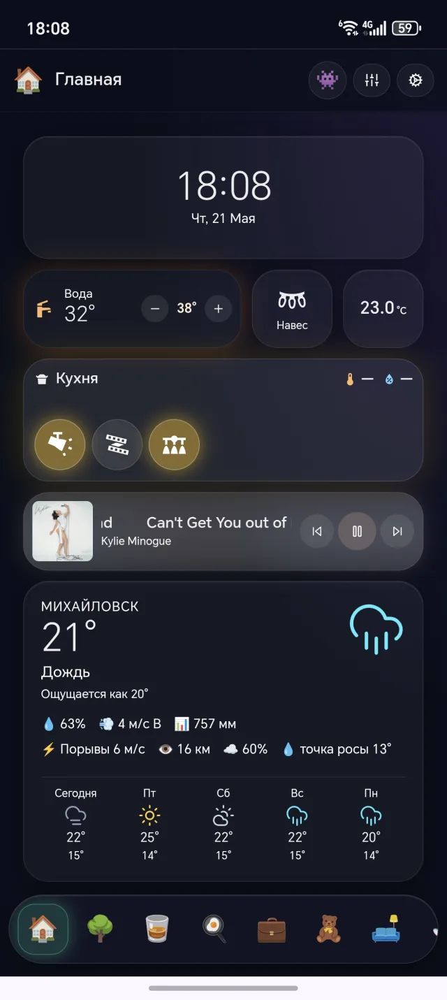
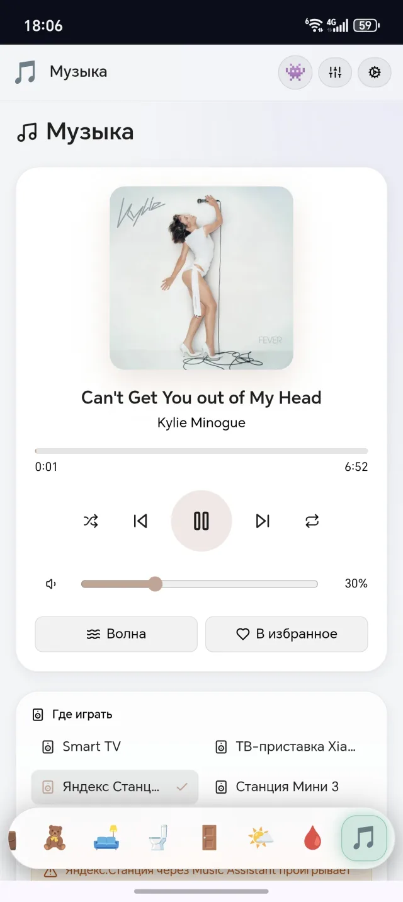
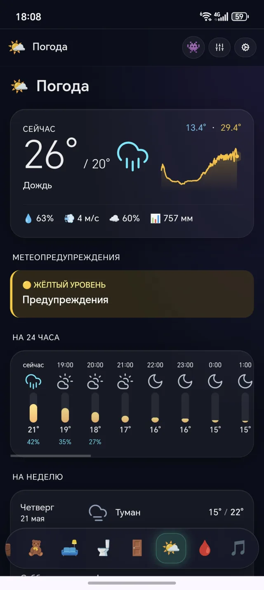
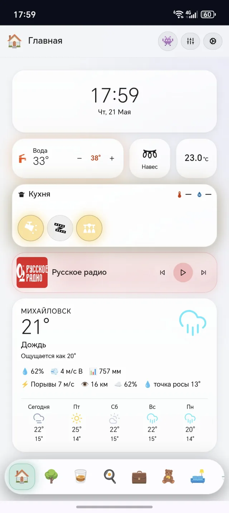
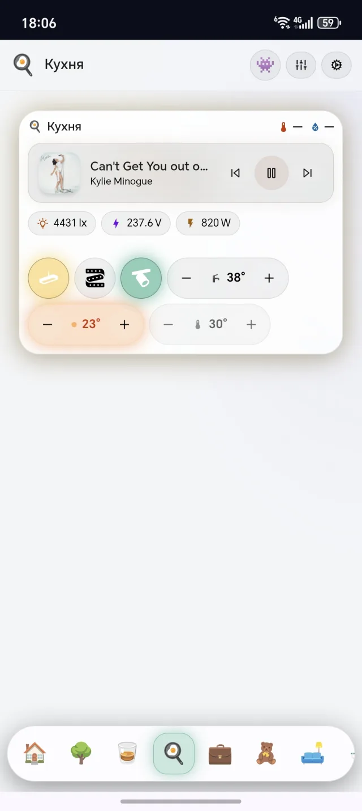
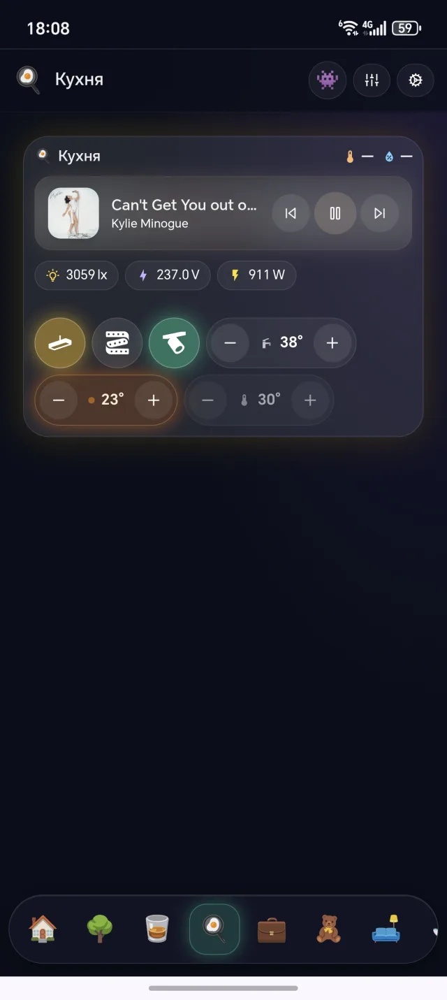
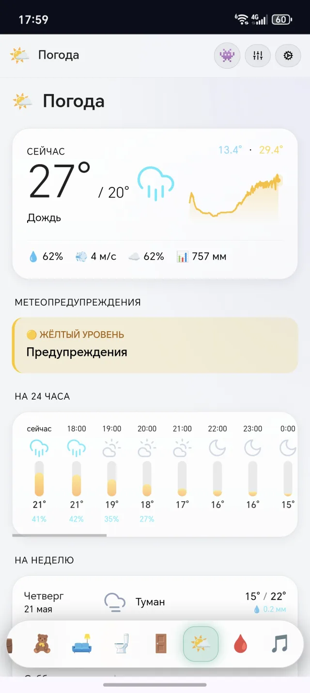
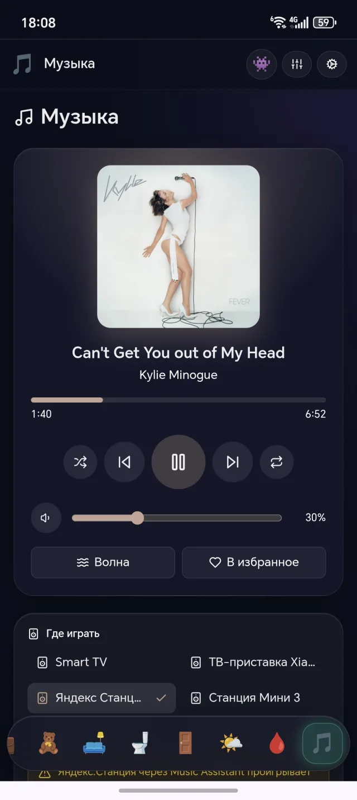
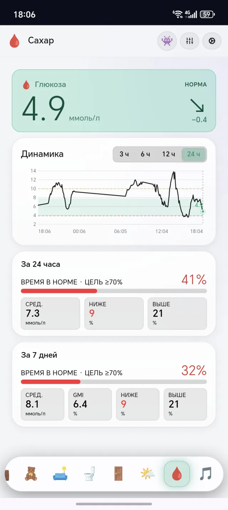
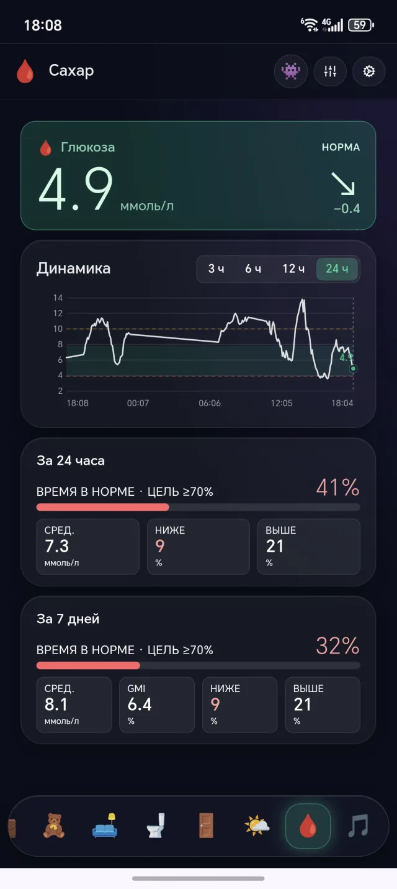

# Homeglance

[English](README.md) · **Русский**

> A modern, mobile-first dashboard for Home Assistant. No YAML, no compromise.

**Homeglance** (внутри приложения — просто **Glance**) — это PWA-панель для Home Assistant, которая работает рядом со стандартным Lovelace, не заменяя его. Цель: дать обычному пользователю опыт уровня iOS-«рабочего стола» — drag-and-drop виджеты, плавные анимации, эффекты «жидкого стекла», темы, многопользовательский режим. Без YAML, без правок HA-конфига.

<p align="center">
  
  
  
</p>

## Возможности

- **Drag-and-drop сетка** — плитки можно двигать, ресайзить, удалять
- **28 виджетов** — свет, переключатели, замки, сенсоры, климат, медиа, камеры, шторы, погода, человек, карта, календарь, энергопотребление, заметки, часы, действия (скрипты/сцены/webhook), панели управления, хабы комнат, мониторинг глюкозы
- **Несколько страниц** с dock-bar внизу — переключение свайпом
- **Multi-user** — несколько профилей с PIN-защитой, каждый со своей раскладкой
- **PWA** — устанавливается как нативное приложение на iOS, Android, desktop
- **Темы dark / light / auto** — следуют системе
- **Интерфейс на русском и английском** — переключается в настройках
- **Подключение к HA через WebSocket** — никаких изменений в HA-конфиге

## Скриншоты

Glance в светлой и тёмной теме — она переключается в настройках или следует
за системной.

| | ☀️ Светлая | 🌙 Тёмная |
|---|---|---|
| **Главная** |  |  |
| **Комната** |  |  |
| **Погода** |  |  |
| **Музыка** |  |  |
| **Мониторинг глюкозы** |  |  |

## Установка

Четыре пути в зависимости от типа вашего HA.

### 1. HA App / Add-on (для HA OS / Supervised — самый простой)

Если у вас Home Assistant OS или Home Assistant Supervised — это самый простой путь. HA сам поднимет Homeglance-сервер и будет им управлять.

> В Home Assistant 2026.2 раздел **Add-ons** переименован в **Apps**. На
> старых версиях HA меню по-прежнему называется **Settings → Add-ons → Add-on Store**.

1. **Settings** → **Apps** → **App store** → ⋮ (три точки) → **Repositories**
2. Добавить URL `https://github.com/Ivkaiv/homeglance` → **Add**
3. Найти **Homeglance** → **Install** → **Start**
4. В боковой панели HA появится **Homeglance** — открыть.

**Zero-config авторизация.** Под HA Ingress приложение автоматически
подключается к HA через `SUPERVISOR_TOKEN` — никаких токенов вручную
создавать не нужно. WS- и REST-запросы к HA проксируются server-side,
токен не покидает контейнер.

**Persistent storage.** Профили, виджеты, темы хранятся в `/data` mount,
который Supervisor сохраняет между рестартами, обновлениями и
переустановками приложения. На любой версии HA Supervisor.

Подробнее: [`homeglance-addon/README.md`](homeglance-addon/README.md).

### 2. HACS plugin (иконка в сайдбаре HA)

> **Когда нужен.** HACS plugin **не нужен**, если вы используете HA App
> (вариант 1) — он уже добавляет Homeglance в боковую панель HA через
> Ingress автоматически. Plugin предназначен для случая, когда сервер
> Homeglance запущен **снаружи** HA: на другом компьютере в сети, в
> Docker (вариант 3) или в HA Core/Container, где приложения недоступны.

Сам по себе plugin не запускает сервер — это iframe-обёртка для уже
запущенного Homeglance. После установки Glance появляется в боковой
панели HA как нативный пункт меню.

1. В HACS → Frontend → Custom repositories → добавить `https://github.com/Ivkaiv/homeglance`, тип **Plugin**
2. Найти **Homeglance** → Install
3. Добавить в `configuration.yaml`:
   ```yaml
   panel_custom:
     - name: homeglance-panel
       sidebar_title: Homeglance
       sidebar_icon: mdi:view-dashboard-variant
       url_path: homeglance
       module_url: /hacsfiles/homeglance/homeglance.js
       config:
         url: "http://homeassistant.local:3040"  # адрес вашего Homeglance-сервера
   ```
4. Перезагрузить HA → в боковой панели появится **Homeglance**

> **Важно:** plugin требует, чтобы где-то в сети уже был запущен
> Homeglance-сервер — Docker (3) или процесс на другом хосте.

### 3. Docker / Docker Compose (любой HA-сценарий)

Подходит для HA Container, HA Core или для вынесения панели на отдельный сервер.

```yaml
# docker-compose.yml
services:
  homeglance:
    image: ghcr.io/ivkaiv/homeglance:latest
    container_name: homeglance
    restart: unless-stopped
    ports:
      - "3040:3040"
    volumes:
      - homeglance-data:/app/data

volumes:
  homeglance-data:
```

Запуск:

```bash
docker compose up -d
```

Открыть `http://server-ip:3040`, ввести URL HA и Long-Lived Access Token, готово.

### 4. Локальный запуск из исходников (для разработки)

```bash
git clone https://github.com/Ivkaiv/homeglance.git
cd homeglance
bun install
bun dev
```

Открыть `http://localhost:3040`.

## Подключение к Home Assistant

При первом запуске Homeglance спросит:

1. **URL Home Assistant** — например `http://192.168.1.10:8123` или `https://ha.example.com`
2. **Long-Lived Access Token** — создать в HA Profile → Security → Long-Lived Access Tokens

Токен хранится локально (на сервере Homeglance в `data/connection.json`, если используется server-storage; либо в localStorage браузера).

## Конфигурация

Все настройки — через UI. По умолчанию никакие env-vars не нужны. Если хочется переопределить:

| Переменная                | По умолчанию | Описание                                     |
|---------------------------|--------------|----------------------------------------------|
| `PORT`                    | `3040`       | Порт сервера                                 |
| `NEXT_TELEMETRY_DISABLED` | `1`          | Отключить телеметрию Next.js                 |

См. `.env.example`.

## Документация

Руководства для пользователя — в директории [`docs/`](docs/) (на английском):

- [Установка и первый запуск](docs/getting-started.md) — подключение к Home Assistant, создание токена, мастер настройки
- [Руководство пользователя](docs/user-guide.md) — редактирование дашборда, страницы, профили, темы
- [Справочник виджетов](docs/widgets.md) — все встроенные плитки
- [Свои виджеты (SDK)](docs/sdk.md) — для разработчиков

## Технологии

- **Next.js 14** (App Router, standalone build)
- **React 18** + **TypeScript** strict
- **Tailwind CSS 4**
- **Framer Motion** — анимации
- **react-grid-layout** — drag/drop
- **Bun** — пакетный менеджер и runtime для разработки

## Статус

**Alpha.** Работает у автора в продакшене, активно развивается. Возможны
изменения и шероховатости. Баг-репорты и предложения — через
[GitHub Issues](https://github.com/Ivkaiv/homeglance/issues).

## Contributing

Любые вклады welcome. Перед PR прочитайте [CONTRIBUTING.md](CONTRIBUTING.md) и [Code of Conduct](CODE_OF_CONDUCT.md).

Если хотите добавить новый виджет — см. [docs/sdk.md](docs/sdk.md).

## License

[MIT](LICENSE) — стандарт для HA-экосистемы.
