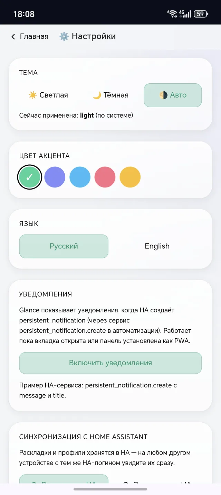

# User guide

How to use Glance day to day: edit the dashboard, work with pages, profiles
and themes.

Just installed? Start with [Getting started](getting-started.md).

## The main screen

The dashboard is a set of **pages**, each holding **widget** tiles (lights,
sensors, the media player, weather). At the bottom of the screen is the
**dock bar** for switching between pages. In normal mode, tapping a widget
controls the device right away: tapping a light turns it on, tapping the
player pauses it.

In the top-right corner are the **Edit** button and the profile avatar.

## Edit mode

To rearrange the dashboard, tap **Edit** in the top-right corner. The button
turns into **Done** — tap it when you are finished. Changes are saved
automatically.

In edit mode the following become available:

- **Widget** — add a new tile;
- **Pages** — manage pages;
- **Settings** — general app settings;
- dragging and resizing widgets.

## Widgets

### Add a widget

1. Enter edit mode → tap **Widget**.
2. The "Add widget" catalog opens, with widgets grouped by category
   (Lights, Sensors, Climate, Media, and so on).
3. Tap the one you want — the tile appears on the page.
4. The configuration sheet opens immediately.

The full list of tiles is in the [widget reference](widgets.md).

### Configure a widget

The **"Configure widget"** sheet is where a tile's parameters are set. The
main field for most widgets is the **entity** — a specific Home Assistant
device. Glance shows a list of matching devices, so you never have to type a
technical ID by hand.

The remaining fields depend on the widget: name, icon, glow color, units,
and so on. Each field has a hint.

To open the configuration of a widget that is already placed, **long-press**
the tile (hold for about half a second) → choose **Configure** from the menu.

### Move and resize

In edit mode:

- **drag** a tile to move it;
- **pull a corner** to resize it.

Widgets are adaptive: at a small size a tile shows only the essentials (an
icon and a value), and at a large size it expands into a full card with
details. Every widget has a minimum size below which it cannot be shrunk.

### Duplicate and delete

A **long-press** on a widget opens a menu:

- **Configure** — open its parameters;
- **Duplicate** — create a copy of the tile next to it;
- **Delete** — remove the tile (Glance asks for confirmation).

## Pages and the dock bar

The dashboard can be split into several pages — for example "Home",
"Kitchen", "Cameras", "Climate". Switching between them is comfortable with
one hand.

- **Switch page** — tap an icon in the dock bar, or swipe left/right on the
  screen.
- **Manage pages** — in edit mode, tap **Pages**.

In the "Pages" sheet you can:

- **create** a new page — set its title, icon and type (a regular dashboard
  or a special "Weather" page);
- **edit** the title and icon of an existing page;
- **reorder** pages;
- **delete** a page (along with all of its widgets);
- **export** one page or all of them to a file — and **import** such a file
  on another device;
- **import from HA Lovelace** — Glance reads your standard Home Assistant
  panel and builds a new page from its devices.

For an empty page, Glance offers to **fill it automatically** from the
devices of the corresponding Home Assistant area — or you can fill it by
hand.

## Profiles

Glance supports multiple profiles — each member of the household gets their
own set of pages and their own layout. A profile is chosen on first launch
and then remembered on the device.

- **Switch profile** — tap the avatar in the top-right corner.
- **Create a profile** — on the profile-picker screen tap "Add profile",
  then set a name, an emoji avatar and, optionally, a PIN.

### PIN and protection

A profile can be given a **4-digit PIN**. Then:

- entering the profile requires the PIN;
- dangerous actions (deleting a profile, disconnecting from Home Assistant)
  also require the PIN.

This is handy, for example, for a wall-mounted tablet: a "guest" profile is
open while the main one is behind a PIN.

**To set or change a PIN:** tap the avatar in the top-right corner → sign
out of the profile → on the sign-in screen, tap the 🔒 icon on the profile
card.

## Themes and appearance

Open **Settings** (in edit mode) — there you will find:

  

- **Theme** — Light, Dark or Auto (follows the device's system theme);
- **Accent color** — emerald, indigo, sky, rose or amber; it highlights
  active elements;
- **Language** — Russian or English.

## Other settings

In the same **Settings** section:

- **Notifications** — Glance can show notifications when Home Assistant
  creates a `persistent_notification` (via an automation). They work while
  the tab is open or the panel is installed as an app.
- **Sync with Home Assistant** — layouts and profiles can be stored inside
  HA. Then on another device with the same HA login you see them right
  away. The **Push to HA** and **Pull from HA** buttons.
- **Home Assistant** — the current connection; you can also disconnect and
  reconnect here.
- **External widgets** — adding third-party widgets by URL (see the
  [developer guide](sdk.md)).

## Install as an app

Glance is a PWA (Progressive Web App). It can be installed on a phone or
computer like a regular app — with an icon on the home screen and no browser
address bar:

- **iPhone/iPad (Safari):** the "Share" button → "Add to Home Screen".
- **Android (Chrome):** the browser menu → "Install app".
- **Desktop (Chrome/Edge):** the install icon in the address bar.
